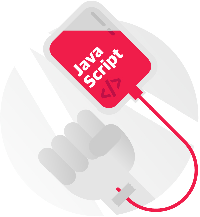

###### Fast Campus

# JJ CAMP Fundamental

JavaScript & jQuery 첫걸음 캠프 [:link:](http://www.fastcampus.co.kr/dev_camp_jstb)

## 코스 목표

전략적으로 자바스크립트를 때려눕혀보자. 10주 동안. :sparkles:

### 확실한 워밍업과 실습 :first_quarter_moon_with_face:

모든 프로그래밍에서 요구되는 기초 개념을 하나씩 이해한 뒤, 자바스크립트란 도대체 무엇이며 어떻게 동작하는 것인지 정확히 이해하자.

- HTML 문서를 제어하는 자바스크립트의 기본 작동 원리 학습
- 대상선택 – 특정 시점 – 기능 수행의 패턴 익히기
- 작동 과정 이해 후, 자바스크립트 기초 문법 공부 시작

### 변수, 데이터 유형 등 :first_quarter_moon_with_face:

자바스크립트는 다양한 데이터 유형을 다룰 수 있고, 이를 편리하게 사용하기 위해 변수를 활용할 수도 있다. 변수 사용시 유의해야 할 점, 변수로 담을 수 있는 데이터 유형 등을 알아보자.

- 자바스크립트에서 활용할 수 있는 다양한 데이터 유형
- 데이터를 기억해서 유용하게 쓸수 있게 해주는 변수
- 변수는 도대체 어떤 상황에서 활용해야 하는가?
- 네이밍 등 변수 사용시 주의해야 할 점
- 변수에 담긴 데이터의 유형 확인해보기

### 함수만 온통 파헤쳐보기 :first_quarter_moon_with_face:

함수란 도대체 무엇이며, 어떤 때에 활용해야하는지 알아본다.

- 함수란 무엇이며, 어떻게 생겼는가?
- 함수가 필요한 순간들, 그리고 활용하는 방법
- 함수를 호출해서 기능성 확장하기

### 연산자, 조건문, 반복문 등 :first_quarter_moon_with_face:

자바스크립트와 어느정도 친해졌고, 프로그래밍의 기초 개념도 일부 이해했으니 조금 더 심화된 내용을 다뤄본다.

- 연산자의 다양한 활용
- 조건에 따라 코드가 다르게 실행되도록 만드는 조건문 작성하기
- 반복작업을 획기적으로 줄여주는 반복문 활용하기

### 객체, jQuery :first_quarter_moon_with_face:

자바스크립트에서 빼놓을 수 없는 객체라는 개념을 익히고, 실무에서 자주 활용되는 jQuery 라이브러리를 배운다. 또한 추가적으로 자바스크립트 관련 유용한 프레임워크, 예컨대 Node.js / Angular.js / React.js 등을 알아본다.

- 생성자와 객체, 그리고 프로토타입
- 가장 유명한 자바스크립트 라이브러리, jQuery
- 기타 자바스크립트 관련 유용한 프레임워크 소개

## 레퍼런스 :books:

- [자바스크립트 첫걸음](REFERENCES/README.md)
- [MDN, JavaScript](https://developer.mozilla.org/ko/docs/Web/JavaScript)
- [비개발자를 위한 Javascript 알아가기](http://www.slideshare.net/ibare/javascript-1-33928468?ref=http://m.cafe.daum.net/aspdotnet/5zmE/153?boardType=U&q=D_wmj6O-wN3vs0&)

